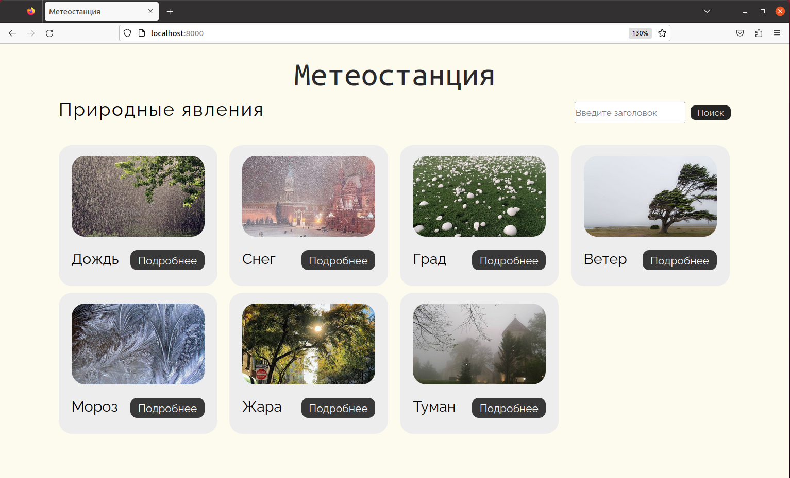

# Репозиторий курса "Разработка интернет приложений"
### Тема: Учёт погодных явлений на метеостанции
### Реализация на Django

## ЛР №1
Интерфейс из двух страниц: карточки с природными явлениями (картинка, название, кнопка "Подробнее") и подробная информация о выбранной карточке.
Поиск по карточкам через GET-запрос. Отображение результата поиска на той же странице, что и с карточками.

